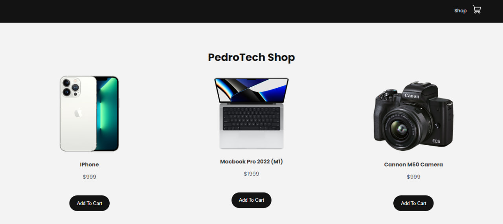

<h1 align="center">E-commerce Beginner</h1>
E-commerce Beginner project is a simple technology shopping site built with React. The site has a simple design. You can order many technologies through the site.

<h2> 🍿 Technology </h2>

E-commerce Design is built using the following technologies:

<ul>
<li>ReactJS</li>
</ul>

<h1> 🍿 How to Run the Website on Your System</h1>
<h2>Step 1: Download and Extract the Code</h2>

Firstly, download the entire website code and extract the ZIP file to a folder on your local system.

<h2>Step 2: Run the Website</h2>

Open your code editor (such as VS Code) and navigate to the project directory. Then, open a terminal and run the following command:

<pre><code>npm start</code></pre>

This will start the application. Open a web browser and navigate to <a href="http://localhost:3000" target="_blank">http://localhost:3000</a> to access the website.

<h1> 🍿 Demo</h1>

Check out our live demo at https://e-commerce-beginner.netlify.app/ 

